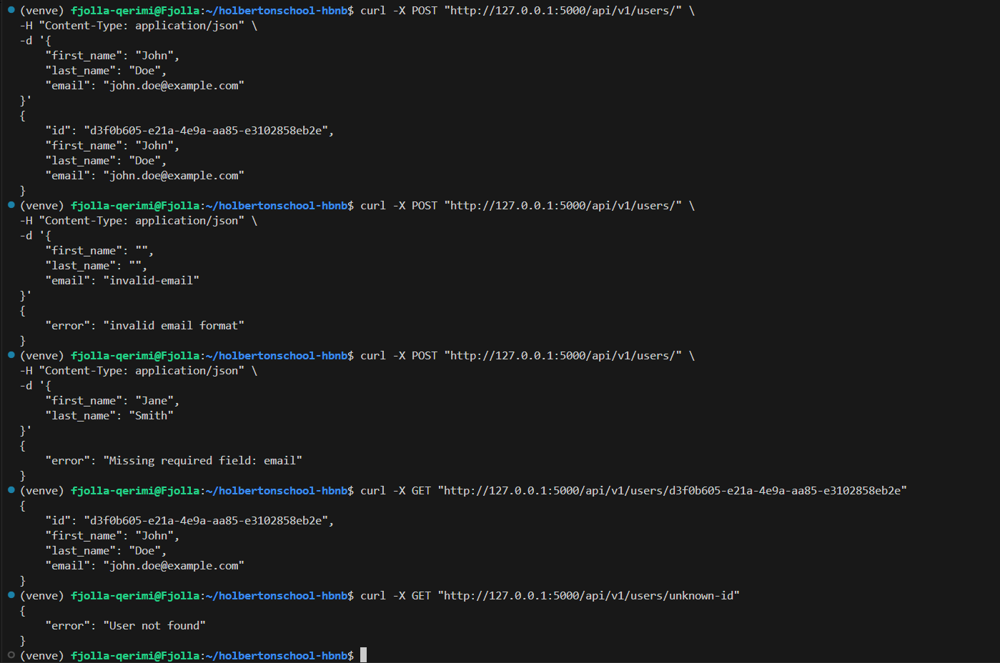
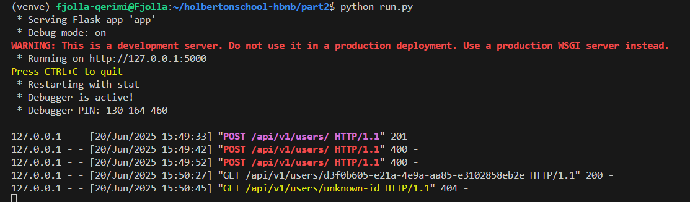
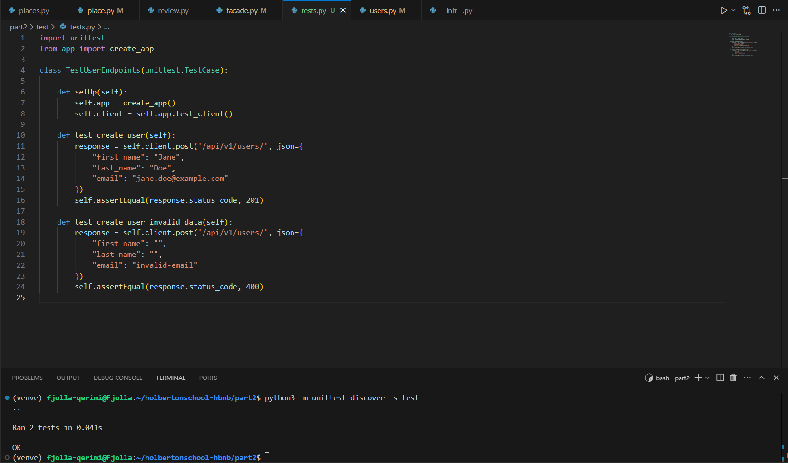

# 🧪 API Testing Documentation – `hbnb` Project

## Overview

This document describes the **testing and validation** process for the RESTful endpoints of the `hbnb` API. It includes:

- Validation rules implemented
- Manual testing using `cURL`
- Automated unit testing with `unittest`
- Summary of successful and failed test cases

---

## ✅ Validation Rules Implemented

### `User` model validation rules:
| Field       | Rule                              |
|-------------|-----------------------------------|
| `first_name`| Must not be empty                 |
| `last_name` | Must not be empty                 |
| `email`     | Must not be empty and valid format|

---

## 🔧 Manual Testing with `cURL`

We tested the `/api/v1/users/` endpoint with various data to ensure both normal and edge cases are correctly handled.

### ✅ 1. Create User – Valid Data

**Command:**
```bash
curl -X POST "http://127.0.0.1:5000/api/v1/users/" -H "Content-Type: application/json" -d '{
  "first_name": "John",
  "last_name": "Doe",
  "email": "john.doe@example.com"
}'
```

**Expected status:** `201 Created`  
**Actual result:** ✅ Success (User created)  
**Output:**
```json
{
  "id": "d3f0b605-e21a-4e9a-aa85-e3102858eb2e",
  "first_name": "John",
  "last_name": "Doe",
  "email": "john.doe@example.com"
}
```

---

### ❌ 2. Create User – Invalid Email Format

**Command:**
```bash
curl -X POST "http://127.0.0.1:5000/api/v1/users/" -H "Content-Type: application/json" -d '{
  "first_name": "",
  "last_name": "",
  "email": "invalid-email"
}'
```

**Expected status:** `400 Bad Request`  
**Actual result:** ✅ Success (Rejected)  
**Output:**
```json
{ "error": "invalid email format" }
```

---

### ❌ 3. Create User – Missing Required Field (`email`)

**Command:**
```bash
curl -X POST "http://127.0.0.1:5000/api/v1/users/" -H "Content-Type: application/json" -d '{
  "first_name": "Jane",
  "last_name": "Smith"
}'
```

**Expected status:** `400 Bad Request`  
**Actual result:** ✅ Success (Rejected)  
**Output:**
```json
{ "error": "Missing required field: email" }
```

---

### ✅ 4. GET Existing User by ID

**Command:**
```bash
curl -X GET "http://127.0.0.1:5000/api/v1/users/d3f0b605-e21a-4e9a-aa85-e3102858eb2e"
```

**Expected status:** `200 OK`  
**Actual result:** ✅ Success  
**Output:**
```json
{
  "id": "d3f0b605-e21a-4e9a-aa85-e3102858eb2e",
  "first_name": "John",
  "last_name": "Doe",
  "email": "john.doe@example.com"
}
```

---

### ❌ 5. GET Non-existent User

**Command:**
```bash
curl -X GET "http://127.0.0.1:5000/api/v1/users/unknown-id"
```

**Expected status:** `404 Not Found`  
**Actual result:** ✅ Success (Handled gracefully)  
**Output:**
```json
{ "error": "User not found" }
```




---

## 🧪 Automated Unit Testing with `unittest`

File: `tests/test_users.py`

### ✔️ Tests run:
1. `test_create_user`: Valid input → expects `201`
2. `test_create_user_invalid_data`: Invalid input → expects `400`

### ✅ Terminal Output:
```
Ran 2 tests in 0.041s

OK
```

### 📂 Code Summary:
```python
class TestUserEndpoints(unittest.TestCase):

    def setUp(self):
        self.app = create_app()
        self.client = self.app.test_client()

    def test_create_user(self):
        response = self.client.post('/api/v1/users/', json={
            "first_name": "Jane",
            "last_name": "Doe",
            "email": "jane.doe@example.com"
        })
        self.assertEqual(response.status_code, 201)

    def test_create_user_invalid_data(self):
        response = self.client.post('/api/v1/users/', json={
            "first_name": "",
            "last_name": "",
            "email": "invalid-email"
        })
        self.assertEqual(response.status_code, 400)
```



---

## 📄 Summary

| Test Scenario                      | Status | Code |
|-----------------------------------|--------|------|
| Create user with valid data       | ✅ Pass| 201  |
| Create user with invalid email    | ✅ Pass| 400  |
| Create user with missing email    | ✅ Pass| 400  |
| Retrieve existing user            | ✅ Pass| 200  |
| Retrieve non-existent user        | ✅ Pass| 404  |
| Automated unit tests (2 total)    | ✅ Pass| OK   |

---

## ✅ Swagger Documentation

Swagger UI successfully loads at:
```
http://127.0.0.1:5000/api/v1/
```

The documentation reflects the structure of requests and responses for the endpoints, including validation rules.