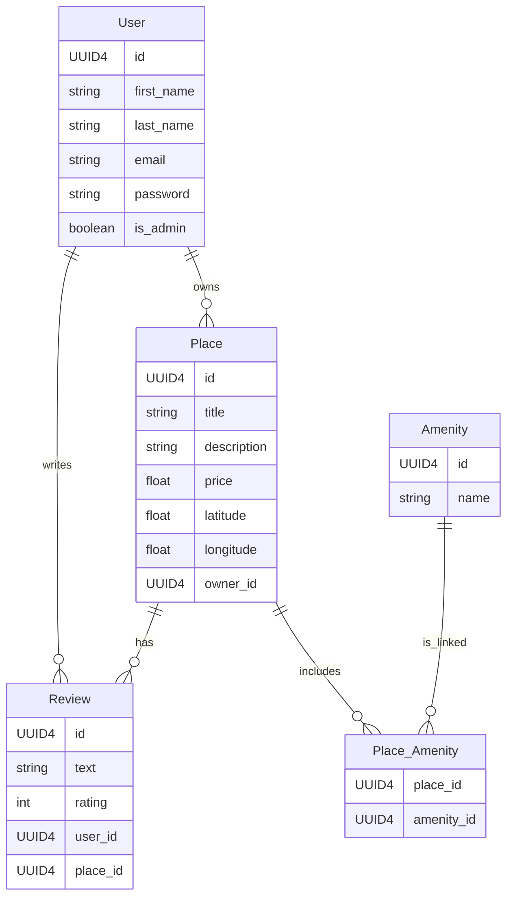

<p align="center">
   
</p>

# HBnB Project — Business Logic & API Endpoints Implementation

## 📌 Overview

This part of the **HBnB Project** focuses on the implementation phase of the application using **Python**, **Flask**, and **Flask-RESTx**. The goal is to bring the previously designed architecture to life by building the **Presentation Layer** (API) and the **Business Logic Layer** (core functionality).

You will create the necessary classes and API endpoints to manage users, places, reviews, and amenities. The architecture is modular and scalable, following industry best practices.

> 🔒 Note: Authentication and access control will be implemented in Part 3.

---

## 🗂️ Project Structure

```bash
hbnb/
├── app/
│ ├── api/ # API (Presentation Layer): Flask-RESTx namespaces and routing
│ │ ├── init.py
│ │ ├── users.py # API endpoints for User entity
│ │ ├── places.py # API endpoints for Place entity
│ │ ├── reviews.py # API endpoints for Review entity
│ │ └── amenities.py # API endpoints for Amenity entity
│ │
│ ├── models/ # Core business logic models
│ │ ├── init.py
│ │ ├── user.py
│ │ ├── place.py
│ │ ├── review.py
│ │ └── amenity.py
│ │
│ ├── persistence/ # In-memory repository for managing data
│ │ ├── init.py
│ │ └── repository.py
│ │
│ ├── services/ # Facade layer to connect API with business logic
│ │ ├── init.py
│ │ └── hbnb_service.py
│ │
│ ├── config.py # Environment-specific configuration
│ └── app.py # Application factory and API setup
│
├── run.py # Entry point to run the application
├── requirements.txt # Python dependencies
└── README.md # Project documentation
```

---

## ⚙️ Setup Instructions

### 1. Clone the Repository

```bash
git clone https://github.com/your-username/hbnb-api.git
cd hbnb-api
```

### 2. Create a Virtual Environment
```bash
python3 -m venv venv
source venv/bin/activate
```

### 3. Install Dependencies
```bash
pip install -r requirements.txt
```

### 4. Run the Application
```bash
python run.py
```

### 5. Access the API Documentation
Once the app is running, visit http://localhost:5000/api/v1/ to access the Swagger UI automatically generated by Flask-RESTx.

---

## 🔍 Access the API Documentation

Once the app is running, visit [http://localhost:5000/api/v1/](http://localhost:5000/api/v1/) to access the **Swagger UI** automatically generated by Flask-RESTx.

---

## 📘 Features Implemented

### ✅ Presentation Layer (API)

- RESTful endpoints built with **Flask-RESTx**
- Organized **namespaces** for each resource
- Automatic **Swagger documentation**

### ✅ Business Logic Layer

- Object-oriented classes for `User`, `Place`, `Review`, and `Amenity`
- Entity **relationships** and **data validation**
- A **facade service layer** (`hbnb_service.py`) to mediate API logic

### ✅ Persistence Layer

- **In-memory data repository** (future integration with a real database is possible)
- Common operations: `add`, `get`, `update`, `delete`, `get_by_attribute`

---

## 📖 Business Logic Layer — Entities & Responsibilities

This project implements a **Business Logic Layer (BLL)** that models the core entities of a booking application: **User**, **Place**, **Amenity**, and **Review**.  
Each entity inherits from `BaseModel`, which provides shared functionality including:  
✅ A unique identifier (`id`)  
✅ Creation and update timestamps (`created_at`, `updated_at`)  
✅ Basic persistence methods (`save`, `update`)  

---

### 📦 Entities and Responsibilities

Below is the ER diagram representing the core entities and their relationships in the HBnB system, created using Mermaid.js:



---

#### `BaseModel`

Common base class:

- Generates a unique `id` (`UUID`)
- Includes `created_at` and `updated_at` timestamps
- `save()` method: updates the `updated_at` timestamp  
- `update(data)` method: updates specified attributes and calls `save()`

---

#### `User`

Represents a user:

- `id`, `created_at`, `updated_at`
- `is_admin`: indicates admin rights
- `first_name`, `last_name`, `email`
- `places`: list of created places
- `reviews`: list of submitted reviews

**Responsibilities:**

- Create new places (`new_place`)
- Submit reviews (`new_review`)

---

#### `Place`

Represents a location offered by a user:

- `id`, `created_at`, `updated_at`
- `owner`: ID of the user who owns the place
- `title`, `description`
- `price`, `latitude`, `longitude`
- `amenitys`: list of linked amenities
- `reviews`: list of linked reviews

**Responsibilities:**

- Add amenities (`add_amenity`)
- Add reviews (`add_review`)

---

#### `Amenity`

Represents an amenity linked to a place:

- `id`, `created_at`, `updated_at`
- `place`: ID of the linked place
- `name`, `description`

---

#### `Review`

Represents a review for a place:

- `id`, `created_at`, `updated_at`
- `place`: ID of the reviewed place
- `user`: ID of the reviewer
- `rating`: score given
- `text`: review content

---

## 🛠 Example Usage

```python
from app.models.user import User
from app.models.place import Place
from app.models.amenity import Amenity
from app.models.review import Review

# Create a user
user = User(is_admin=False, first_name="Alice", last_name="Smith", email="alice@example.com")

# Create a place
place = Place(owner=user.id, title="Cozy Apartment", description="A nice apartment in the city center", price="100")

# Link the place to the user
user.new_place(place)

# Add an amenity to the place
wifi = Amenity(name="WiFi", description="High-speed wireless internet")
place.add_amenity(wifi)

# Submit a review
review = Review(place=place.id, user=user.id, rating="5", text="Great stay!")
user.new_review(review)
place.add_review(review)

# Update the place
place.update({"price": "120", "description": "Updated description"})

# Save changes
place.save()
user.save()
```

---

## 🌟 Notes

- Each entity is independent, but relationships are maintained through associated lists (`places`, `reviews`, `amenitys`).
- The model is designed to be extensible — new entities or features can be added easily.

---

## 🚀 Coming Next

- 🔐 **JWT Authentication**
- 🔐 **Role-based Access Control**
- 🧪 **Automated Unit Testing**
- 🗄️ **Persistent Storage** (Database support)

---

## 🧠 Learning Outcomes

- Modular **Flask application** structure
- Building **RESTful APIs** with `flask-restx`
- Implementing **business logic** and entity relationships
- API documentation using **Swagger UI**
- **Testing** and **debugging** RESTful services
